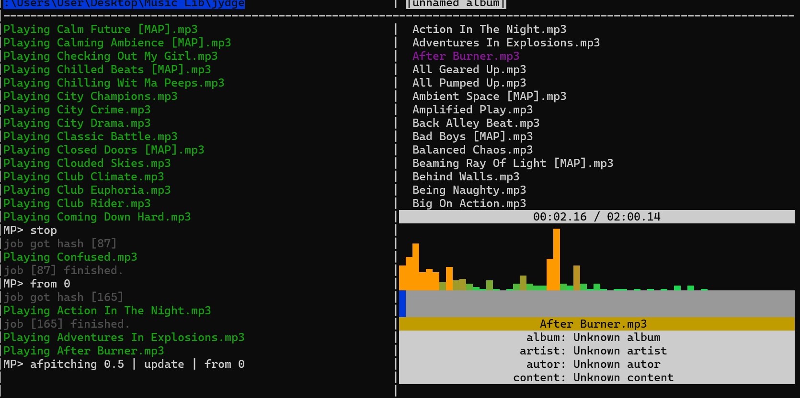
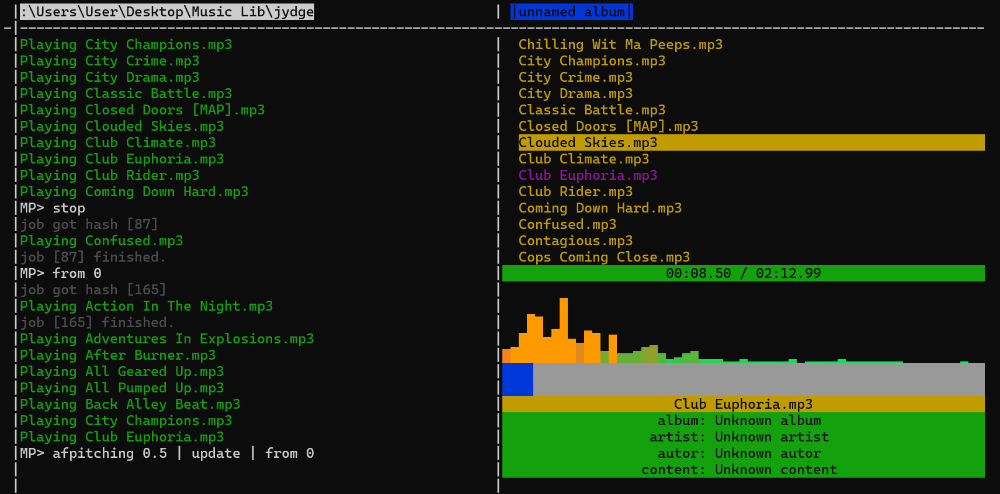
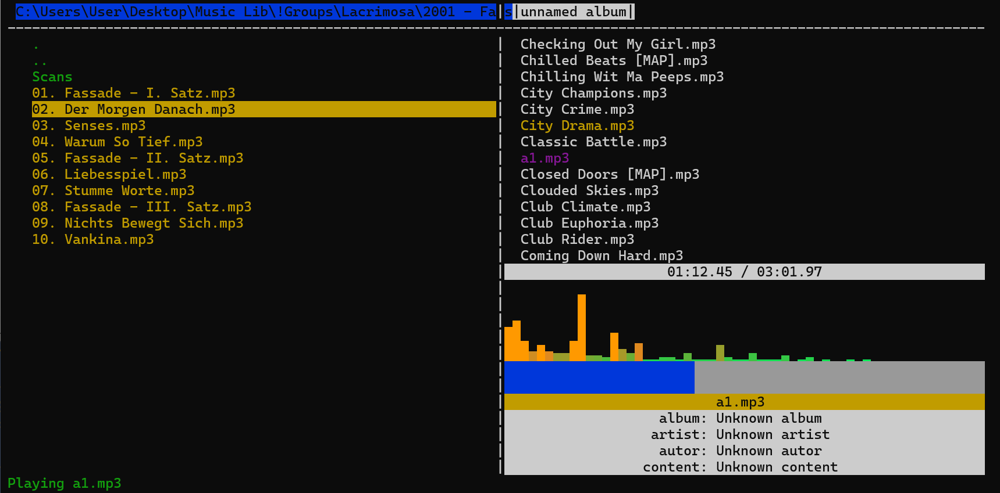
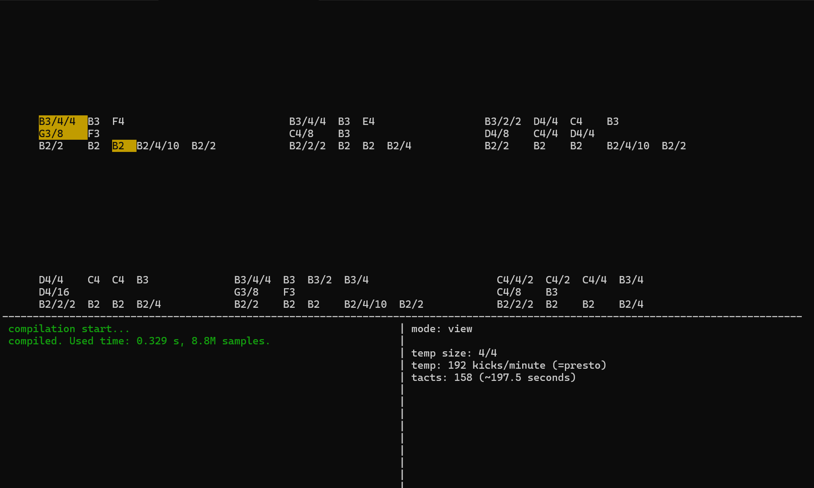
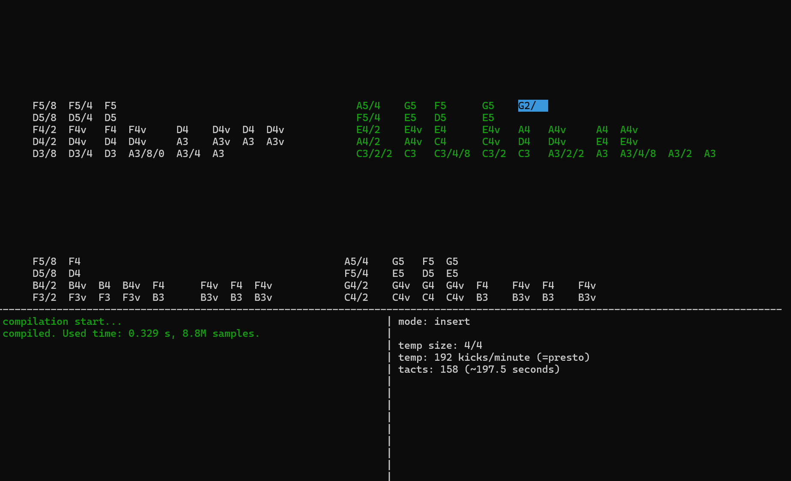
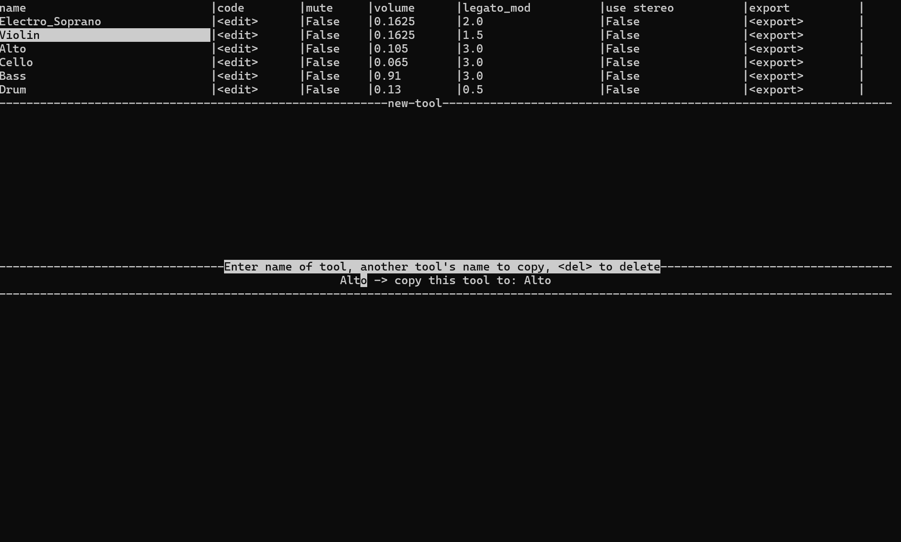

# climp
Command Line Interface Music Player written with python and c + opencl

# music player
<table>
    <tr>
        <td></td>
        <td></td>
        <td></td>
    </tr>
</table>


* Tested only on Windows yet.
* Console music player, supports some formats (mp3, wav, ogg, midi, may be others).
* Real time spectrogram of playing music.
* Albums (not implemented many albums, and their saving/loading).
* Music processing: speeding, pitching, other filters and features (open for implementations).
* Explorer screen to find music.
* Simple console to music loading, listening and processing, supporting async tasks, cycles (for mass processing), functions, etc.
* Saving processed tracks in wav format

# music writer
<table>
    <tr>
        <td></td>
        <td></td>
        <td></td>
    </tr>
</table>

* Support synthesizer mode (base sound coding, with low not standard music support (like micro-tonal music, etc.)), other modes maybe appear later (this one is sufficient).
* Easy writing code-like language.
* Powerful tools system. You can manage OpenCL kernel code for each tool, and make any sound, as you want.
* Bad-working (but working) auto tool creation system (from music file (wav, mp3, etc.)) 
* Uses gpu to generate sound samples (fast).

# music processing

* Almost all functions I wrote myself, so them are not best (in quality and speed) 
* Saving processed tracks in wav format
* Using built-in simple console, you can process many tracks or declare functions, etc. (now, functions is not saving between sessions.)

# how to install 

> [!CAUTION]
> build of library is unaviable now.
> you can build it manually (Good variant), or use pre built for Windows (Bad variant)


> [!IMPORTANT]
> This program needs library only if you want to listen your writed music in 'music writer'.
> All other parts (music player and music processing) don't depend on it.

* ### Windows
    1. build it with powershell:
        (run in repo directory)
        ```ps1
        .\install\windows.ps1
        ```
        available flags:
        ```
        [string] -buildDirectory "..."   - path and name of directory to install (default="./build")
        [boolean] -buildLibrary          - if false, not try to build music generation library (default=$true)
        [boolean] -usePreCompiledLibrary - if true, copy compiled library. Bad practice, but not need installed gcc/openCL/etc. (default=$false)
        ```
    3. use result in 'build' directory. (run using python "code/music_player.py", "run.bat" or "run.ps1")
* ### Linux
    test in plans (not implemented, see others part)
* ### Others
    to build it alone:
    1. Source python and c code located in 'source' directory. Run file 'music_player.py'
    2. To use c library, build it as shared object, and connect in end of 'music_player.py', using ctypes

## depend on
1. installed python (version 3.11 tested, but it maybe won't cause errors in some previous.)
2. python libs: numpy, mutagen, librosa, pygame, curses (different packages for windows and unix.). 
To install program you can use shell scripts in directory /install.
3. To use fast procedural music generation you can use c bindings with graphic card usage.
It is not tested yet. (since version 2.2.0)
you can use compiled programs, but if you need to compile it yourself,
you need: Gcc, OpenCL, [to easy install you can use Code Blocks]
